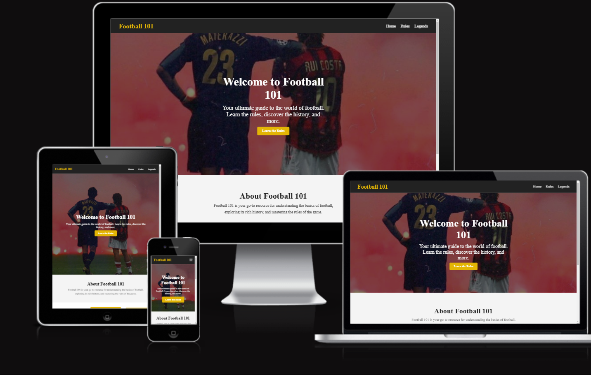

# ⚽ Football 101 - The Ultimate Guide to Football

## 📖 Overview

🔗 **Live Site**: [Football 101](https://cpinheiro15.pythonanywhere.com/)

**Football 101** is an interactive platform designed to simplify football for beginners and enthusiasts alike. Whether you're learning the rules, exploring the history, or testing your knowledge with quizzes, this website provides an engaging and educational experience.

## 🌟 Key Features

### 🎓 Interactive Learning Experience

- **Comprehensive Football Education**
  - Clear and detailed rule explanations
  - Profiles of legendary football players
  - Engaging quizzes to test your knowledge

### ❓ Quiz Functionality

- **Multiple Quiz Categories**
  - Random Quiz
  - World Cup
  - Premier League
  - Champions League
  - Iconic Players
  - Football Rules

### 👥 User Interaction

- **Secure User Authentication**
  - Registration & login system
  - Profile management
  - 
### 📱 Responsive Design

Football 101 offers a seamless experience across desktops, tablets, and mobile devices, making learning accessible anywhere.



## 🎯 Project Purpose

Football 101 is designed for anyone looking to deepen their understanding of football. With visual aids, interactive features, and clear explanations, learning becomes easy and enjoyable.

## 🛠️ Technical Overview

- **Backend**: Django Web Framework
- **Frontend**: HTML5, CSS3, JavaScript
- **Hosting**: PythonAnywhere
- **Database**: SQLite (development) → MySQL (production)

## 📌 Pages Overview

- **🏠 Home Page**: Introduction to the site and football basics
- **⚖️ Rules Page**: Comprehensive football rules explained
- **🌟 Famous Players Page**: Profiles of iconic footballers
- **📝 Quiz Page**: Interactive quizzes to test and improve knowledge

## 🚀 Unique Selling Points

✔ Beginner-friendly football education  
✔ Engaging, interactive learning experience  
✔ Comprehensive coverage of football history and rules  
✔ Gamified learning through quizzes and leaderboards  

## 📊 Lighthouse Performance Audit

Performance results for key pages:

- **🠠Index Page**  
- **⚖️ Rules Page**  
- **🌟 Famous Players Page**  
- **📠Quiz Page**  

## 🔮 Future Roadmap

- ✅ Expand quiz categories
- ✅ Add detailed player and team histories
- ✅ Implement social sharing features
- ✅ Introduce quiz difficulty levels

## 🏗️ Technologies Used

- **Backend**: Django
- **Frontend**: HTML5, CSS3, JavaScript
- **Deployment**: PythonAnywhere

## ✅ Code Validation

This project follows the latest web development standards:

- **HTML**: [W3C HTML Validator](https://validator.w3.org/)
- **CSS**: [W3C CSS Validator](https://jigsaw.w3.org/css-validator/)
- **JavaScript**: [JSHint](https://jshint.com/)

## ⚙️ Setup & Installation

To run the project locally:

```bash
# Clone the repository
git clone https://github.com/cpinheiro15/Football-101.git
cd Football-101

# Set up virtual environment
python -m venv venv
source venv/bin/activate  # On Windows use `venv\Scripts\activate`

# Install dependencies
pip install -r requirements.txt

# Apply database migrations
python manage.py migrate

# Start the development server
python manage.py runserver
```

Enjoy exploring the world of football with **Football 101**! ⚽🎉
